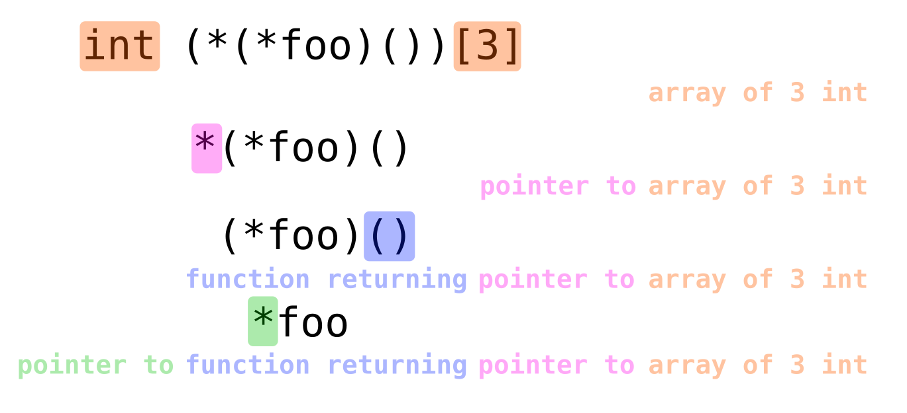

Nowadays when people use modern programming languages, the C style type declarations 
seem to be a bit cryptic. Take for example the array declaration:

```c
int arr[10];
```

But isn't the type of `arr` a `int[10]`? So because the type usually is located before the identifier it should be `int[10] arr`, right?
The same situations happens with functions, instead of `int f(int a, int b)` maybe it should be `int(int, int) f`, 
because then the types and identifiers parts are separated.

In this article I will not introduce any left-to-right or right-to-left rules, but I will try to explain 
the syntax of C declarations in a way that is easy to understand.

## Fundamentals

In C language we can distinguish two types: basic ones and derived ones. Basic types are `int`, `char`, `float`, `double`, `void`, etc.
The derived ones are arrays, pointers and functions.

The syntax for declaring each of the derived types is:
- `int *p` - pointer to int
- `int a[10]` - array of 10 ints
- `int a[]` - array of unknown size
- `int f(int, int)` - function taking two ints and returning int

## Idea behind the syntax

The syntax was designed to mimic the way the expressions are evaluated.
Every of the derived types starts with `int` (or any other basic type).
That's what the expression would evaluate to if we would fill the gaps.

Let's look at each of the derived types and see how they are evaluated:

### Arrays

When you declare an array you write:
```c
int arr[10]
````
Now to get the `int` value from the identifies you would write:
```c
arr[i]
``` 
just replace `10` with `i`.

Simmilarly, if you would write `int arr[10][20]` you would get `arr[i][j]` and so on.

### Pointers

When you declare a pointer you write:
```c
int *p
``` 
and to get the `int` value from the pointer you would write:
```c
*p
```
that straightforward.

### Functions

When you declare a function you write:
```c
int f(int, int)
``` 
and to get the `int` value from the function you would write:
```c
f(a, b)
```
where `a` and `b` are the arguments.

## Combinations of derived types

Now let's look at some more complex examples. Let's try to declare an array of pointers to functions.
If we would have such variable, to get the return value of the function we would write `(*(arr[i]))(a, b)`.
So the declaration would be `int (*(arr[]))(int, int)`.

### Array of pointers

Below i'm going to assume that the base type that the expressions evaluate to is `int`, but it could be any other type.
When reading this expression `*arr[i]` there are actually two interpretations.

1. `int val = (*arr)[i]` - `arr` is a pointer to an array of ints
2. `int val = *(arr[i])` - `arr` is an array of pointers to ints

Based on where we put the parentheses the outcome is different and without them, the second interpretation is correct. 
So we may conclude, that `[]` (right operator) has higher precedence than `*` (left operator).

### Function pointers

Simmilarly, when reading the expression `*f(a, b)` there are two interpretations.

1. `int val = (*f)(a, b)` - `f` is a pointer to a function that takes two arguments and returns an int
2. `int val = *(f(a, b))` - `f` is a function that returns a pointer to an int

For people somewhat familiar with C syntax, it's clear that the second interpretation is the correct one. 
Again, the `()` (left operator) has higher precedence than `*` (right operator). 

In summary, the pointer operator `*` has lower precedence than both `[]` and `()`.

Naturally, the next question drags on, what is the precedence of `[]` and `()`?
Actually becasue they are both postfix operators, they are evaluated from innermost to outermost, 
so in `f(a,b)[i]` it's clear that `f(a,b)` is evaluated first and then the result is indexed with `i`. 

When you are unsure about the precedence of operators, you can always use parentheses to make it clear.

## Reading complex examples

Now let's try to read some more complex examples:
```c
int (*(*foo)())[3]
```

So we know, that when we write `(*(*foo)())[3]` we get an `int`. 
We can work our way from the outside to the inside, like this:

1. `(*(*foo)())[3]` - is an int
2. `*(*foo)()` - is an array of 3 ints
   (note that `*f()` is a function that returns a pointer to an int, so going from the end to the begining, the "type extension" that is later is the pointer, so we get rid of it)
3. `(*foo)()` - is a pointer to an array of 3 ints
4. `*foo` - is a function that returns a pointer to an array of 3 ints
5. `foo` - is a pointer to a function that returns a pointer to an array of 3 ints

We can imagine some decomposition like this:


This example can be found in the [C gibberish <-> english translation](https://cdecl.org/) website.

Working from the oustide is quite difficult, so most tutorials suggest to work from the inside to the outside.
But the same rules apply, just in reverse order. We can translate:
* `*foo` - pointer to
* `foo()` - function returning
* `foo[]` - array of

Going from the inside to the outside, when we encounter `*foo()` the parentheses have higher precedence than `*`, 
so we should read the `()` first and then the `*`.

In the example above, removing the parenthesis from `(*(*foo)())[3]` we get `*(*foo())[3]` and then we would interpret it differently.

Another example:
```c
long **foo[7];
```

1. `**foo[7]` - is a `long`
2. `*foo[7]` - is a pointer to a `long`
3. `foo[7]` - is a pointer to pointer to `long`
4. `foo` - is an array of 7 pointers to pointers to `long`

## Abstract declarators

The "C" standard declares an "abstract declarator" which is a declaration without an identifier.
It's useful for example in casting. It's the same declarator as the normal one, but without the identifier, 
so we have to find where the identifier would be.

Some rules include:
* to the left of all "function returning" operators,
* to the left of all "array of" operators,
* to the right of all "pointer to" operators,
* in the innermost parentheses.

Example:
```c
int (*(*)())()
```
We can here that the are two possible places for an identifier:
```
int (*(*foo)())()
```
or
```
int (*(*)foo())()
```
But the second one is not in the innermost parentheses, so the first one is correct.

## Summary

The syntax of C declarations is not that difficult, but it requires some practice to get used to it.
The key is to remember that the syntax was designed to mimic the way the expressions are evaluated.
So when you see a declaration, try to imagine how you would use it in an expression and it will be easier to understand.
