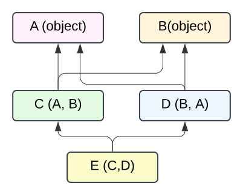
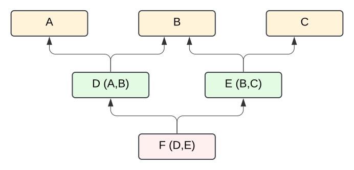
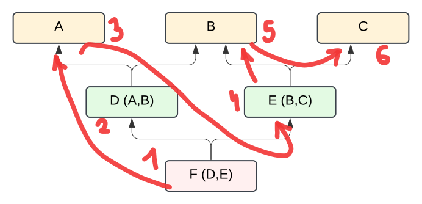

The post is based on the [The Python 2.3 Method Resolution Order](https://www.python.org/download/releases/2.3/mro/) article by Michele Simionato and *Fluent Python* book by Luciano Ramalho.

## What is "MRO"?

Method Resolution Order is a term used in Python to describe the order in which classes are searched 
for a method or variable when using class inheritance (also we can say that this is an order in which method are overriden). For example:

```python
class A:
    def m(self):
        print("method of A called")

class B:
    def m(self):
        print("method of B called")

class C(A,B):
    def check(self):
        self.m() # <--------  Which method will be called?
```

If you are not fammiliar with the python class inheritance syntax, the class `C` is inheriting from both `A` and `B`. 
It is legal in Python to inherit from multiple classes and even more, the order of inheritance is very important. The MRO is also called a "linearization" of the inheritance tree, since we want to have a linear order of classes in which the method is searched.

To start with investigating on how the MRO is calculated, the authors of Python have given us useful tool play with:

**The class MRO can be easily checked with `__mro__` built-in attribute.**

```python
>>> print(C.__mro__)
Class mro: [<class 'C'>, <class 'A'>, <class 'B'>, <class 'object'>]
```

When we call a method `m` from the class `C`, the method is searched in the following order:
1. `C`
2. `A`
3. `B`
4. `object`

Since method `m` is defined in both `A` and `B`, the method of `A` will be called.

## Some class hierarchies are not allowed

Let's move on to a more complex example:

```python
class A:
    pass

class B:
    pass 

class C(A,B):
    pass

class D(B,A):
    pass

class E(C,D):
    pass
```




Let's think what the MRO of class `E` would be and pay special attention to the `A` and `B` classes. If we would *go depth first then left to right* then we would have the following order:

1. `E`
2. `C`
3. `A`
4. `B`
5. `D`

But then the `A` class would be before the `B` class, which is not what the `D(B,A)` class expected. This would lead to hard to catch 
mistakes, so Python does not allow such class hierarchies. If you try to run the code above, you will get the following error:

```
TypeError: Cannot create a consistent method resolution
order (MRO) for bases A, B
```


One of the author's of Python, Michele Simionato, defined formal condition for the MRO and called it **monotonicity**:

- MRO is **monotonic** if the following is true: if class A precedes class B in the MRO of class C, then all subclasses of C should also have A before B in their MRO.

In the example above, such MRO that would satisfy the monotonicity doesn't exist, so Python raises an error.

## It was solved with Python 2.3 and C3 linearization algorithm

The problem of monotonicity was solved in Python 2.3 with the C3 linearization algorithm. 
Let's say we define the MRO of the class `C(C1, C2, C3, C4, ..., CN)` (so `C` is inheriting from multiple classes).
The linearization of any class `X` will be denoted as `L[X]`. So our goal is to find `L[C]`.
First we compute the linearizations of all the base classes and store them in a list `L[C1], L[C2], L[C3], ..., L[CN]`.
Now it's the time to construct the resulting MRO of the class `C`.

The first element in the MRO would be `C` itself. 
Then we merge the linearizations of the base classes in the following way:

1. Check if the first element of the first base class linearization (ex. `L[C1]`) is not in the tail of any other base classes linearizations (ex. `L[C2], L[C3], ..., L[CN]`). 
2. If it is not, then we can add it to the final MRO and remove it from every base class linearizations. We go to step 1. 
3. If it is, then we move to the **next** base class linearization in the list and repeat the process with the **next base class**.
4. If we went though all of the base classes and all of its first elements are in the tail of some other base class linearization, then we have a problem and we cannot create a consistent MRO. We raise an error.

## Bigger tree example



We can go through one phase of the algorithm to see how it works. Let's compute the MRO of the class `F` and 
let's assume that we already did the linearizations of the base classes:
- L[D] = [D, A, B]
- L[E] = [E, B, C]

So our list of linearizations is `[[D, A, B], [E, B, C]]`.

Now we can start constructing the `L[F]` and place `F` as the first element.

- **result = [F], bases = [[D, A, B], [E, B, C]]**
  
    Then we check the first element of the first linearization which is `D`.
    `D` is not in the tail of any other linearizations, so we can add it to the result.

- **result = [F, D], bases = [[A, B], [E, B, C]]**

    We check the first element of the first linearization which is `A`.
    `A` is not in the tail of any other linearizations, so we can add it to the result.

- **result = [F, D, A], bases = [[B], [E, B, C]]**
  
    We check the first element of the first linearization which is `B`.
    `B` is in the tail of the second linearization, so we can't add it to the result.
    We move to the second linearization.

- **result = [F, D, A], bases = [[B], [E, B, C]]**
    
    We check the first element of the second linearization which is `E`.
    `E` is not in the tail of any other linearizations, so we can add it to the result.

- **result = [F, D, A, E], bases = [[B], [B, C]]**

    We check the first element of the first linearization which is `B`.
    Now `B` is not in the tail of any other linearizations, so we can add it to the result.
    Note that it is in the head of the second linearization, so we remove it from there as well.

- **result = [F, D, A, E, B], bases = [[], [C]]**
- **result = [F, D, A, E, B, C], bases = [[], []]**

We can double check with the `__mro__` attribute:

```python
class A:
    pass

class B:
    pass 

class C:
    pass 

class D(A,B):
    pass

class E(B,C):
    pass

class F(D,E):
    pass

print("Class mro:", F.mro())
>>> Class mro: [<class 'F'>, <class 'D'>, <class 'A'>, <class 'E'>, <class 'B'>, <class 'C'>, <class 'object'>
```

Note that the every Python class inherits from the `object` class. Using the C3 linearization algorithm, we also make sure that the `object` class is always the last one in the MRO.



In summary, the algorithm performs roughly the strategy "go deep-first as far as possible not breaking the monotonicity, if you can't 
try next base class". 

## Conclusion

The complexity of the MRO was a surprising discovery for me. Some time ago for a job interview I was met with much simpler Python inheritance order question and I was not able to answer it. 
Altough the design of the MRO is very intuitive in simple cases, the exact algorithm is not widely known. On the other hand, the author of the *Fluent Python*  points out that there are very few real world cases when multiple inheritance and MRO was needed in a project 
and nowadays it is strongly advices against using mutliple inheritance, as it introduces complex code dependencies in projects. 99% of the time someone needed multiple inheritance, they needed to implement the **Java's interface** use to reduce code boilerplate (so they didn't rely on MRO). Also, the inheritance is strongly overused by the programmers and in many cases can be replaced with composition. 

In the future episode I will try to cover the **super** keyword in Python and how it works with the MRO.